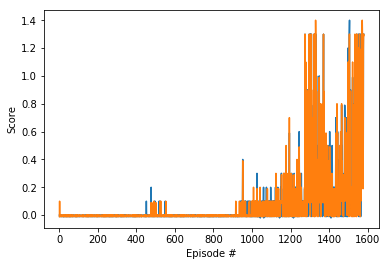

# Report

The implementation here is similar to the MADDPG algorithm, which is a multi-agent extension for DDPG [1]. I started with the project 2 submission (which itself is a modified form of the Udacity DDPG-bipedal notebook extended for multiple agents [2,3]) and was modified to run better on a different environment. The big change here was having a separate set of neural network for each agent.

## Learning algorithm

The learning algorithm is based on Deep Deterministic Policy Gradients (DDPG) which learns the Q functions, and in turn uses the Q-function to learn the policy. More details on this can be found at [4]. The hyperparameters we used are listed below:

* Replay buffer size: 1e6
* Minibatch size: 256   
* Discount factor: 0.99            
* Tau (for update of target parameters): 1e-3             
* Actor learning rate: 3e-4        
* Critic learning rate: 3e-4       
* L2 weight decay: 0.0   
* Number of agents: 2
* Maximum number of timesteps per episode: 1e5
* OU Noise theta: 0.15
* OU Noise sigma: 0.`

### Model Architectures:

#### Actor 

Actor(\
&nbsp;&nbsp;&nbsp;&nbsp;&nbsp;&nbsp;  (fc1): Linear(in_features=33, out_features=512, bias=True)\
&nbsp;&nbsp;&nbsp;&nbsp;&nbsp;&nbsp;  (fc2): Linear(in_features=256, out_features=256, bias=True)\
&nbsp;&nbsp;&nbsp;&nbsp;&nbsp;&nbsp;  (fc3): Linear(in_features=128, out_features=4, bias=True)\
)

#### Critic

Critic(\
&nbsp;&nbsp;&nbsp;&nbsp;&nbsp;&nbsp;  (fcs1): Linear(in_features=33, out_features=512, bias=True)\
&nbsp;&nbsp;&nbsp;&nbsp;&nbsp;&nbsp;  (fc2): Linear(in_features=260, out_features=256, bias=True)\
&nbsp;&nbsp;&nbsp;&nbsp;&nbsp;&nbsp;  (fc3): Linear(in_features=128, out_features=1, bias=True)\
)

## Results

The environment was solved in 1400 timesteps

## Ideas for Future Work

* Implement MADPPG: I would like to try the MADDPG on this. From reading posts in the knowledge center, it appears that other students have had a lot of success with this.
* Hyperparamter tuning: Convergence was relatively fast, but I would still like to do  so I would like to do additional hyperparameter tuning to identify an even more optimal set of hyperparameters.
* Try other multi agent algorithms: I would like to try PPO, TRPO, Rainbow & A3C to compare performance.
* Architecture modifications: I would like to see how modifications to both the control flow (e.g. how many times we update during a step) and neural network architectures to compare performance.

## References
1. https://arxiv.org/pdf/1706.02275.pdf
2. https://github.com/udacity/deep-reinforcement-learning/tree/master/ddpg-bipedal
3. https://github.com/agiocochook/drl_p2_continuous-control
4. https://spinningup.openai.com/en/latest/algorithms/ddpg.html
